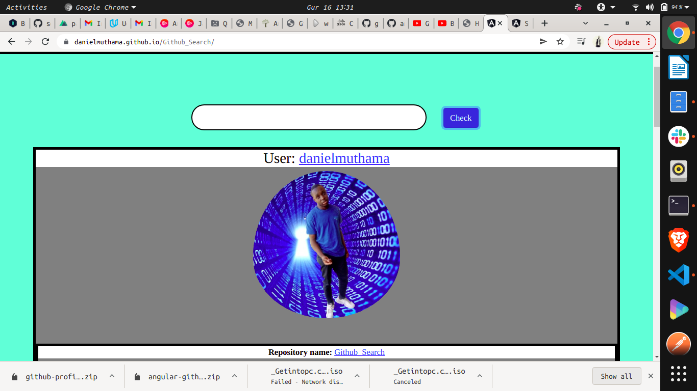

## GithubSearch

<link
      rel="stylesheet"
      href="https://cdnjs.cloudflare.com/ajax/libs/font-awesome/6.0.0-beta2/css/all.min.css"
      integrity="sha512-YWzhKL2whUzgiheMoBFwW8CKV4qpHQAEuvilg9FAn5VJUDwKZZxkJNuGM4XkWuk94WCrrwslk8yWNGmY1EduTA=="
      crossorigin="anonymous"
      referrerpolicy="no-referrer"
    />

<div style="text-align: center; ">
        <div>
            <h1>I am <span style="color: green; ">Daniel Muthama</span> <span style='font-size:50px;'> &#128075</span></h1>
            <h3>A Software Developer &#128187; &#127911;</h3>
        </div>
        
</div>
<br>

### Angular Quote App <span style='font-size:30px;'> </span> 


<br>


<br>


### Demo &#128273;

Here is a live link to the project 


https://danielmuthama.github.io/Quote_Appl/



### Usage <span style='font-size:30px;'>🖋</span> 
If you want to view the code or change some elements on the website, you are welcomed to clone the project

``` git
git clone git@github.com:danielmuthama/angular-Quote-Appl.git

```

Then run npm install to download all the node modules
```npm
npm install

```

After everything is install. Run ng serve to start the project server

```ng
ng serve
```


### Technology Used <span style='font-size:30px;'>&#128187;</span> 

1. Angular

2. Typescript

3. Bootstrap


This project was generated with [Angular CLI](https://github.com/angular/angular-cli) version 13.2.3.

### Development server

Run `ng serve` for a dev server. Navigate to `http://localhost:4200/`. The app will automatically reload if you change any of the source files.

### Code scaffolding

Run `ng generate component component-name` to generate a new component. You can also use `ng generate directive|pipe|service|class|guard|interface|enum|module`.

### Build

Run `ng build` to build the project. The build artifacts will be stored in the `dist/` directory.

### Running unit tests

Run `ng test` to execute the unit tests via [Karma](https://karma-runner.github.io).

### Running end-to-end tests

Run `ng e2e` to execute the end-to-end tests via a platform of your choice. To use this command, you need to first add a package that implements end-to-end testing capabilities.

## Further help

To get more help on the Angular CLI use `ng help` or go check out the [Angular CLI Overview and Command Reference](https://angular.io/cli) page.
### Author <span style='font-size:30px;'>&#128524;</span> 

Daniel Muthama

#### License  <span style='font-size:30px;'>🔐</span> 
[MIT](https://choosealicense.com/licenses/mit/)
